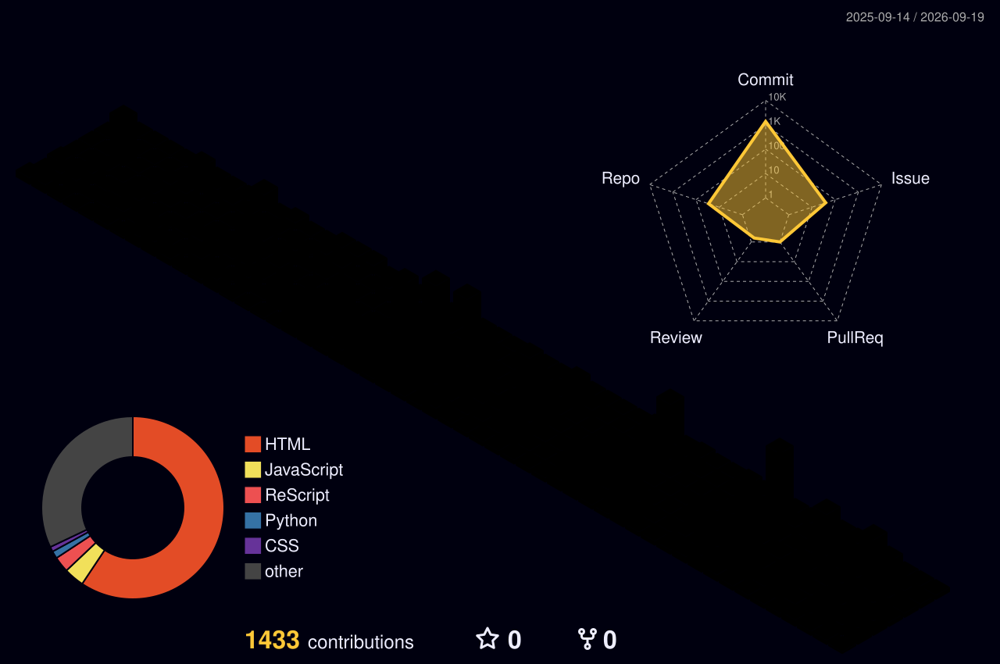

  

<h1 align="center"> 👋 Hi, I'm Euler0525 </h1>

  <strong> This is the place where I opensource stuff and break things.</strong>

  
  

## 🙋‍♂️ About Me

- 🎮 Being self-driven and committing to continuous learning

- 🎓 Pursuing my Master's in **Network and Information Security** at **Beijing Institute of Technology**

- 🔥 Exploring the world of **AI Infra** and **HPC**

- 💡 Always excited to chat about any cool tech stuff — join me at [Discussions](https://github.com/Euler0525/Euler0525/discussions)

<!--
## 📈 GitHub Stats

  
  

-->

## 🔥 Contribution Activity

  

<!--

  

-->

## 📊 Programming Stats

<h3 align="center"> 🛠️ Tech Stack </h3>

  
  
  
  
  
  

  

## 📚 Reference

- [Metrics](https://metrics.lecoq.io/)
- [GitHub/GitLab Star History](https://codetabs.com/github-stars/github-star-history.html)
- [GitHub Star History](https://www.star-history.com/)

